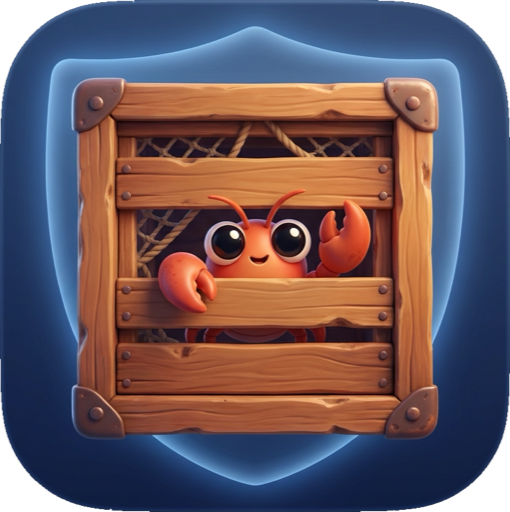

<p align="center">
  
</p>

<h1 align="center">ClawCrate</h1>

<p align="center">
  <strong>Policy + evidence for everything your AI agent executes.</strong>
</p>

<p align="center">
  Your agent runs free. Your secrets stay locked.
</p>

<p align="center">
  <a href="#quickstart">Quickstart</a> •
  <a href="#why">Why</a> •
  <a href="#differentials">Differentials</a> •
  <a href="#profiles">Profiles</a> •
  <a href="#replica-mode">Replica Mode</a> •
  <a href="#mcp-server-firewall">MCP Firewall</a> •
  <a href="#audit-trail-you-can-prove">Audit</a> •
  <a href="#cli-reference">CLI</a> •
  <a href="#contributing">Contributing</a>
</p>

<p align="center">
  
  
  
  
</p>

---

Your AI agent just ran `npm install` on a repo with a malicious postinstall script. That script read `~/.ssh/id_rsa`, `~/.aws/credentials`, and every `.env` file in your project. It POST'd everything to a server in Eastern Europe. You didn't know until someone used your AWS keys to spin up $14,000 in GPU instances.

**ClawCrate is the governance layer for agent-executed commands: minimal authority going in, portable evidence coming out — for _any_ agent.** The mechanism is a single Rust binary that sandboxes every command with native kernel primitives (Landlock + seccomp on Linux, Seatbelt on macOS). No Docker. No VMs. No root. Overhead you can't measure. But the sandbox is not the product — the product is that your agent only ever gets the authority a profile grants, and every run leaves a tamper-evident audit trail you can verify offline.

```
Agent says: "run npm test"
    │
    ▼
clawcrate run --profile build -- npm test
    │
    ├── Sandbox applied (kernel-level, irremovible, inherited by children)
    ├── Env vars scrubbed (AWS_SECRET_ACCESS_KEY → gone)
    ├── Filesystem: read project, write only target/
    ├── Network: blocked
    ├── Audit: hash-chained evidence written to disk
    │
    ▼
npm test runs normally. Your secrets never left the vault.
```

## Quickstart

```bash
# Install (macOS or Linux)
curl -fsSL https://github.com/manuelpenazuniga/ClawCrate/releases/latest/download/install.sh | sh

# Run your first sandboxed command
clawcrate run --profile safe -- echo "hello from the sandbox"

# See what would happen without executing
clawcrate plan --profile build -- cargo test

# Check your system's sandboxing capabilities
clawcrate doctor

# Prove a past run wasn't tampered with
clawcrate verify <run-id>
```

Your first sandboxed execution in under 60 seconds. Installs from the latest published GitHub Release; see [CHANGELOG.md](CHANGELOG.md) for version details.

## Why

Every `npm install`, `pip install`, `cargo build`, or `git clone` your agent runs inherits **all your permissions**: SSH keys, AWS credentials, API tokens, browser cookies, Keychain. One malicious postinstall script — or one hallucinated package name that turns out to be malware — and the damage is complete.

ClawCrate exists because:

- **Agents shouldn't decide their own limits.** The sandbox is external, kernel-enforced, inherited by all child processes, and impossible to remove from inside.
- **Filesystem isolation isn't enough.** Environment variables leak secrets too. ClawCrate scrubs `AWS_SECRET_ACCESS_KEY`, `GITHUB_TOKEN`, `SSH_AUTH_SOCK`, and dozens more — before the process even starts.
- **"It ran in a sandbox" isn't evidence.** Compliance teams, incident responders, and the EU AI Act want records. ClawCrate emits hash-chained, signable artifacts for every run.
- **Docker is too heavy for this.** 500ms–2s startup, hundreds of MB, daemon dependency. ClawCrate adds <5ms.
- **macOS matters.** Two-thirds of agent users run macOS. ClawCrate uses native Apple Silicon sandboxing — no VMs, no emulation, no performance loss.

### What ClawCrate is NOT

- **Not an agent.** It doesn't make decisions, rewrite prompts, or talk to LLMs.
- **Not a container runtime.** No images, no layers, no daemon.
- **Not a VM replacement.** If you need isolation against kernel exploits, use a VM. ClawCrate is defense-in-depth at the process level.
- **Not magic.** If your agent has legitimate access to a credential and a destination, ClawCrate can't prevent misuse of that access.

## Differentials

Every agent vendor already ships an internal sandbox, and the kernel primitives are free. What no single vendor can own without ceasing to be agent-agnostic is the combination of **least-authority policy + kernel enforcement + tamper-evident evidence**. Five differentials, defensible today:

1. **Only standalone dual-platform native sandbox** — Landlock + seccomp (Linux) and Seatbelt (macOS), no Docker, no root, one Rust binary. Alternatives are agent-internal, Docker-based, or single-platform.
2. **Audit-grade by default, MIT licensed** — SHA-256 hash chain, canonical JSON (RFC 8785), offline `clawcrate verify`, Ed25519 signing, SIEM export. Matches closed-source tools; beats the plain logs of agents' internal sandboxes.
3. **MCP Server Firewall** — `clawcrate mcp wrap` transparently sandboxes any stdio MCP server; the client never notices. Nobody else does this.
4. **Agent-agnostic** — the same binary serves OpenClaw, Claude Code, Codex, Cursor, Gemini CLI, and CI.
5. **Concrete compliance narrative** — EU AI Act Article 12/19/26 mapping plus IETF draft-sharif alignment. Turns "security" into regulatory evidence.

Strategic basis: [strategic audit](docs/strategic-audit-2026-07-05.md) · execution plan: [roadmap](docs/roadmap-2026-07-05.md).

> **Honesty guardrails.** Read isolation is enforced on macOS (Seatbelt) and on Linux (Landlock read-allowlisting): the sandboxed process may read only the profile's read/write set plus a minimal system allowlist (loader, libraries, name resolution, TLS trust). A toolchain installed outside those prefixes — for example under `/opt` — must be declared by the profile. Custom profiles that grant broad read paths are only as narrow as you make them, and Replica Mode remains the strongest option for filtering secrets out of the workspace itself. `network: filtered` is proxy-mediated best-effort (see the [egress proxy threat model](docs/egress-proxy-threat-model.md)).

### How it compares

| | ClawCrate | Docker / containers | Agent-internal sandboxes | WASM isolates |
|---|---|---|---|---|
| Startup overhead | <5 ms | 500 ms – 2 s + daemon | built in | low |
| Runs native toolchains (node, python, git) | ✅ | ✅ | ✅ | ❌ (WASI can't) |
| Works with any agent | ✅ | DIY glue per agent | ❌ locked to one vendor | SDK-specific |
| Tamper-evident audit trail | ✅ hash-chained, signable, offline-verifiable | plain logs | plain logs | varies |
| Root or daemon required | ❌ | daemon | ❌ | ❌ |

## How It Works

```
clawcrate run --profile build -- cargo test --release
    │
    ├─ 1. RESOLVE PROFILE     build → read workspace + toolchain, write target/,
    │                         network blocked, env scrubbed
    ├─ 2. PLAN                permissions granted/denied (visible via `clawcrate plan`)
    ├─ 3. MATERIALIZE         Direct: run in place · Replica: filtered copy, no secrets
    ├─ 4. SCRUB ENV           AWS_*, GITHUB_TOKEN, SSH_AUTH_SOCK, *_SECRET*, ...
    ├─ 5. APPLY SANDBOX       Linux: Landlock + seccomp-bpf + rlimits
    │                         macOS: Seatbelt SBPL (filesystem + network + process)
    │                         → irremovible, inherited by all child processes
    ├─ 6. LAUNCH              Linux: fork → sandbox in-process → exec
    │                         macOS: exec via sandbox-exec
    ├─ 7. CAPTURE             stdout/stderr piped, fs-diff snapshot before/after
    └─ 8. EVIDENCE            ~/.clawcrate/runs/exec_{id}/
                              plan.json · result.json · stdout.log · stderr.log
                              audit.ndjson (hash-chained) · fs-diff.json
```

## Profiles

Four built-in profiles. No YAML required.

| Profile | Filesystem | Network | Env | Workspace Mode | Use Case |
|---------|-----------|---------|-----|---------------|----------|
| **safe** | Read: workspace | Blocked | Scrubbed | Direct | Tests (read-only), linting, analysis |
| **build** | Read: workspace + toolchain. Write: output dirs | Blocked | Scrubbed | Direct | Compilation, tests, coverage |
| **install** | Read: workspace. Write: dependency dirs | Open (with warning) | Scrubbed | **Replica (default)** | npm install, pip install, cargo fetch |
| **open** | Read/Write: workspace | Open | Partially scrubbed | Direct | General-purpose scripts |

```bash
clawcrate run --profile safe -- pytest -q
clawcrate run --profile build -- cargo test --release
clawcrate run --profile install -- npm install express   # replica mode automatic
clawcrate run --profile open -- ./deploy.sh
```

> **`install` uses Replica Mode by default** because it's the highest-risk profile: postinstall scripts with network access. Use `--direct` to opt out (not recommended).

Community profiles ship for MCP and inference workloads (`mcp-readonly`, `mcp-server`, `agent-inference-allowlist`) — see [community profiles](docs/community-profiles.md).

### Custom Profiles (YAML)

```yaml
# .clawcrate/custom.yaml
name: my-project
extends: build
filesystem:
  write: ["./custom-output"]
  deny: [".env", ".env.local"]   # macOS only (Seatbelt regex)
environment:
  passthrough: ["MY_CUSTOM_VAR"]
resources:
  max_cpu_seconds: 300
  max_memory_mb: 4096
```

```bash
clawcrate run --profile .clawcrate/custom.yaml -- make build
```

## Replica Mode

The most dangerous commands need both write access and network access. `npm install` is the poster child: postinstall scripts can read your `.env` files and exfiltrate them.

**Replica Mode** creates a filtered copy of your workspace, runs the command there, and syncs changes back only with your explicit confirmation.

```bash
clawcrate run --profile install -- npm install express   # replica automatic
clawcrate run --replica --profile build -- cargo test    # force replica anywhere
clawcrate run --direct --profile install -- npm install  # opt out (you accept the risk)
```

- Copy exclusions: `.env`, `.env.*`, `.git/config`, plus any rules in `.clawcrateignore`.
- Precedence: `--replica` / `--direct` flags override the profile default.
- **Sync-back always requires explicit confirmation** in interactive mode; with `--json` it is deterministically skipped.

## MCP Server Firewall

Every MCP server your agent connects to runs with your full permissions — same problem, new surface. `clawcrate mcp wrap` puts any stdio MCP server behind a profile, transparently: the client speaks JSON-RPC to ClawCrate, ClawCrate relays to the sandboxed server, and nobody has to change a line of code.

```bash
# Sandbox a filesystem MCP server behind the mcp-readonly profile
clawcrate mcp wrap --profile mcp-readonly -- npx -y @modelcontextprotocol/server-filesystem ./workspace

# One command to rewrite your Cursor / Claude Desktop / Continue config
clawcrate mcp install --client cursor --server-name filesystem --profile mcp-readonly

# Undo it just as easily
clawcrate mcp uninstall --client cursor --server-name filesystem
```

`mcp install` previews with `--dry-run`, always backs up the original config, and refuses to double-wrap. See the runnable demo at [`examples/mcp-filesystem-demo/`](examples/mcp-filesystem-demo/): normal reads work, secrets are unreachable, writes fail, env is scrubbed, network is blocked — all enforced by the kernel.

## Audit Trail You Can Prove

Every run writes evidence to `~/.clawcrate/runs/exec_{id}/`:

```
├── plan.json       What was permitted and denied
├── result.json     Exit code, duration, status
├── stdout.log      Complete stdout
├── stderr.log      Complete stderr
├── audit.ndjson    Every sandbox decision — SHA-256 hash-chained, one JSON line per event
└── fs-diff.json    Files created, modified, deleted
```

The audit log is a hash chain over canonical JSON (RFC 8785), optionally signed with Ed25519:

```bash
clawcrate verify <run-id>                    # offline integrity check
clawcrate verify <run-id> --pubkey key.pem   # + signature validation
clawcrate audit export <run-id> --format cef # SIEM export: json | cef | syslog | elastic
```

For regulated AI-agent deployments, start with the adopter-facing [EU AI Act compliance statement](docs/compliance-statement-eu-ai-act.md) — what ClawCrate does and does not claim for Article 12/19/26 record-keeping — backed by the detailed [compliance mapping](docs/eu-ai-act-compliance.md) and [IETF audit-trail alignment](docs/ietf-audit-trail-alignment.md).

## CLI Reference

```
clawcrate run     [--profile P] [--replica | --direct] [--approve-out-of-profile] [--json] -- COMMAND...
clawcrate plan    [--profile P] [--replica | --direct] [--json] -- COMMAND...
clawcrate doctor  [--json]
clawcrate verify  RUN_ID [--pubkey KEY.pem] [--json]
clawcrate audit   export RUN_ID [--format json|cef|syslog|elastic]
clawcrate mcp     wrap [--profile P] -- COMMAND...
clawcrate mcp     install|uninstall --client <cursor|claude|continue> --server-name NAME [--dry-run]
clawcrate api     [--bind ADDR] [--token TOKEN] [--allow-remote-bind]
clawcrate bridge  pennyprompt [--pretty]
```

| Flag | Effect |
|------|--------|
| `--profile <name>` | Built-in profile (safe, build, install, open) or path to YAML |
| `--replica` / `--direct` | Force workspace mode, overriding the profile default |
| `--approve-out-of-profile` | Bypass approval prompt for permission requests outside the active profile |
| `--json` | Machine-readable output (for agent integration) |
| `--verbose` / `-v` | Detailed diagnostic logs |
| `--no-color` | Disable ANSI colors (also honors `NO_COLOR=1`) |
| `--allow-remote-bind` | Required to bind `api` to a non-loopback address. The API can start sandboxed runs, so it is loopback-only by default |

`clawcrate run` forwards `SIGINT`/`SIGTERM` to the sandboxed child, still writes final artifacts before exit, and enforces a runtime timeout from profile `resources.max_cpu_seconds`.

## Architecture

### Dual-Platform Native Sandboxing

| | Linux | macOS |
|---|-------|-------|
| **Mechanism** | Landlock LSM + seccomp-bpf | Seatbelt (sandbox-exec) |
| **Filesystem** | Landlock read-allowlisting + write controls | Path + regex deny (intra-workspace) |
| **Syscalls** | seccomp-bpf per-syscall filtering | Seatbelt operation categories |
| **Network** | Blocked by default | Blocked by default |
| **Root required** | No (kernel 5.13+) | No |
| **Irremovible** | Yes | Yes |
| **Performance** | Native | Native (Apple Silicon, no VM) |

### Crate Structure

```
crates/
├── clawcrate-types/       Shared types, enums, errors
├── clawcrate-profiles/    Profile engine, presets, auto-detection
├── clawcrate-sandbox/     SandboxBackend trait + platform implementations
│   ├── linux.rs           Landlock + seccomp + rlimits
│   ├── darwin.rs          Seatbelt SBPL generator
│   ├── env_scrub.rs       Cross-platform env scrubbing
│   └── doctor.rs          System capability detection
├── clawcrate-capture/     stdout/stderr capture, fs-diff (snapshot pre/post)
├── clawcrate-audit/       Artifact generation, hash chain, signing
└── clawcrate-cli/         Clap CLI entry point
```

## Compatibility

ClawCrate works with any agent that executes shell commands — it integrates at the boundary where the agent delegates execution, not by wrapping the agent itself:

| Agent | Integration |
|-------|------------|
| OpenClaw | Wrap tool calls: `clawcrate run --profile build -- <command>` |
| Claude Code | Use as execution layer for shell tools |
| Codex (OpenAI) | Wrap in CI or local dev |
| Cursor / Continue | `clawcrate mcp install --client ...` for MCP servers; wrap terminal commands |
| Gemini CLI | Same pattern |
| Any CLI agent | `clawcrate run --profile safe -- <anything>` |

Recipes: [integration guide](docs/integration-guide.md) and [docs/integrations/](docs/integrations).

## System Requirements

| Platform | Minimum | Recommended |
|----------|---------|-------------|
| **Linux** | Kernel 5.13+ (Landlock v1) | Kernel 6.7+ for newer Landlock capabilities |
| **macOS** | macOS 12+ (Monterey) | macOS 14+ (Sonoma) |

Run `clawcrate doctor` to check your system.

## Roadmap

Detailed, sequenced plan: [docs/roadmap-2026-07-05.md](docs/roadmap-2026-07-05.md) (active). Strategic basis: [docs/strategic-audit-2026-07-05.md](docs/strategic-audit-2026-07-05.md). GitHub milestones/issues are the scope source of truth.

- [x] **Alpha** — `run`, `plan`, `doctor`, `api`, `bridge`. Profiles. Dual-platform sandbox. Replica mode. Artifacts.
- [x] **P1/P2** — Egress proxy (proxy-mediated domain filtering; see threat-model caveats). Approval workflow. Community profiles. SQLite audit storage. API/bridge hardening.
- [x] **v0.2.0 — Compliance Kit + MCP Firewall** — SHA-256 hash chain, canonical JSON, offline `verify`, Ed25519 signing, SIEM export; `clawcrate mcp wrap` transparent JSON-RPC relay.
- [ ] **v0.2.0 — Adoption Wave** _(in progress — Epic 8 · [#270](https://github.com/manuelpenazuniga/ClawCrate/issues/270))_ — shipped: one-command `mcp install`, EU AI Act adopter statement, sandboxed filesystem MCP demo. Remaining: exfil→blocked demo narrative, launch assets.
- [ ] **v0.3.0 — Foundations** — Linux read-isolation parity (Landlock read-allowlisting) + hardening _(Epic 6 · [#268](https://github.com/manuelpenazuniga/ClawCrate/issues/268))_, scalability/maintainability paydown _(Epic 7 · [#269](https://github.com/manuelpenazuniga/ClawCrate/issues/269))_.
- [ ] **v0.4.0 — Adoption & Ecosystem** — `clawcrate learn` auto-policy _(Epic 1 · [#222](https://github.com/manuelpenazuniga/ClawCrate/issues/222))_, `profiles.dev` marketplace _(Epic 3 · [#221](https://github.com/manuelpenazuniga/ClawCrate/issues/221))_, distribution: GitHub Action + integrations + VS Code _(Epic 5 · [#220](https://github.com/manuelpenazuniga/ClawCrate/issues/220))_.
- [ ] **v1.0** — Structural network enforcement, `replay`, certifications, plugin system, surface freeze _(Epic 9 · [#271](https://github.com/manuelpenazuniga/ClawCrate/issues/271))_.

## Contributing

ClawCrate is MIT licensed. Contributions welcome.

```bash
git clone https://github.com/manuelpenazuniga/ClawCrate.git
cd clawcrate
cargo build --workspace
cargo test --workspace
cargo clippy --workspace -- -D warnings
```

**Key docs:**

- [CLAUDE.md](CLAUDE.md) — development guide: architecture decisions, coding standards, build steps
- [docs/WORKFLOW.md](docs/WORKFLOW.md) — issue-to-PR workflow used in this repository
- [docs/architecture.md](docs/architecture.md) · [docs/profiles-reference.md](docs/profiles-reference.md) · [docs/kernel-requirements.md](docs/kernel-requirements.md) — technical reference
- [docs/egress-proxy-threat-model.md](docs/egress-proxy-threat-model.md) — network-filtering design baseline
- [docs/community-profiles.md](docs/community-profiles.md) — community profile catalog and contribution workflow
- [CHANGELOG.md](CHANGELOG.md) · [docs/release-checklist.md](docs/release-checklist.md) — releases

## License

MIT — see [LICENSE](LICENSE).

---

<p align="center">
  <strong>Your agent runs free. Your secrets stay locked.</strong>
</p>
